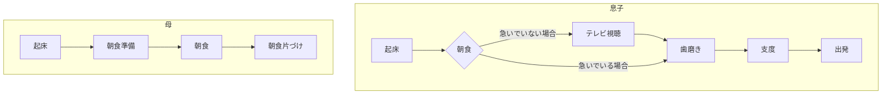

### python
- PrimeStudy
- DiveIntoCode
- kindleで「python　問題集」
https://www.youtube.com/watch?v=PjKVqj7hN-w&t=0s

```mermaid
flowchart TD

subgraph 息子
a1[起床]-->a2{朝食}
a2-->|急いでいない場合|a3[テレビ視聴]-->a4[歯磨き]
a2-->|急いでいる場合|a4
a4-->a5[支度]-->a6[出発]
end

subgraph 母
b1[起床]-->b2[朝食準備]-->b3[朝食]-->b4[朝食片づけ]
end
```

### 7日間ハッキング

- 安全なパスワードの設定・管理

